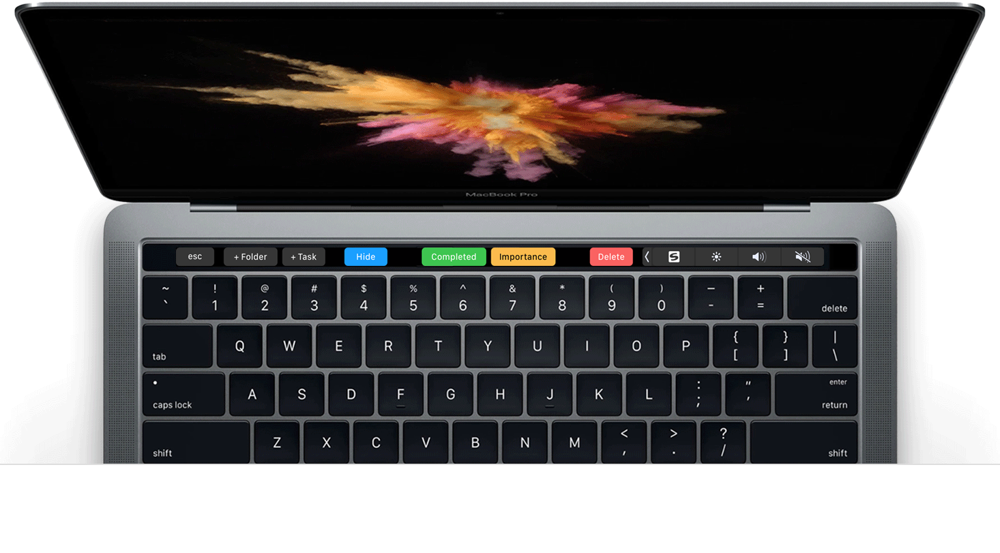

  

<h1 align="center">Microsoft ToDo</h1>

> 背景：想找个云端多设备支持（mac/ios）的todo软件，iOS的AppStore上发现微软出品的To-Do不错，但是没有macOS端（微软可能是故意的🤪）

喜欢就点个赞吧，谢谢！！！

[EN Docs](README_EN.md)

- 基于 [Electron](https://electronjs.org/) & [Electron Vue](https://simulatedgreg.gitbooks.io/electron-vue/)
- 微软 [Outlook Task API](https://docs.microsoft.com/en-us/previous-versions/office/office-365-api/api/version-2.0/task-rest-operations)

## 特性/TODO

- Microsoft To-Do macOS客户端 ✔︎
- 原生APP的体验 ✔︎
- 清新易用的界面 ✔︎
  - 界面显示 ✔︎
  - 搜索  ✔︎
  - 清单
    - 新建 ✔︎
    - 编辑 ✔︎
    - 删除 ✔︎
  - 任务
    - 列表 ✔︎
    - 新建 ✔︎
    - 编辑
      - 提醒时间 ✔︎
      - 截止日期 ✔︎
      - 重复 ✘（接口数据不准确）
      - 附件 ✔︎
      - 备注 ✔︎
    - 删除 ✔︎
  - 设置
    - 智能文件夹  ✔︎
    - 同步数据 ✔︎
    - 持久化存储 ✔︎
- 支持快捷键操作 ✔︎
  - 新建清单 (Cmd + Shift + N) ✔︎
  - 选择清单 (Cmd + ↑/↓) ✔︎
  - 新建任务 (Cmd + N) ✔︎
  - 选择任务 (↑/↓) ✔︎
  - 搜索/取消搜索 (Cmd + F/ESC) ✔︎
  - 偏好设置 (Cmd + ,) ✔︎
- 支持TouchBar操作 ✔︎
  - 新建清单 ✔︎
  - 新建任务 ✔︎
  - 隐藏/显示已完成任务 ✔︎
  - 完成/开始任务 ✔︎
  - 重要/取消重要 ✔︎
  - 删除任务 ✔︎
- 中英文支持 ✔︎
- 暗黑模式（支持macOS 10.14 Mojave的系统设置，其他系统版本可手动设置）✔︎
- 在线升级 ✔︎
- 提示信息 ✔︎

## 截图

> 图一设计稿来自：[https://dribbble.com/shots/3054412-Macbook-Pro-with-touchbar](https://dribbble.com/shots/3054412-Macbook-Pro-with-touchbar) by [Myro Fanta](https://dribbble.com/Fantic)
> 

