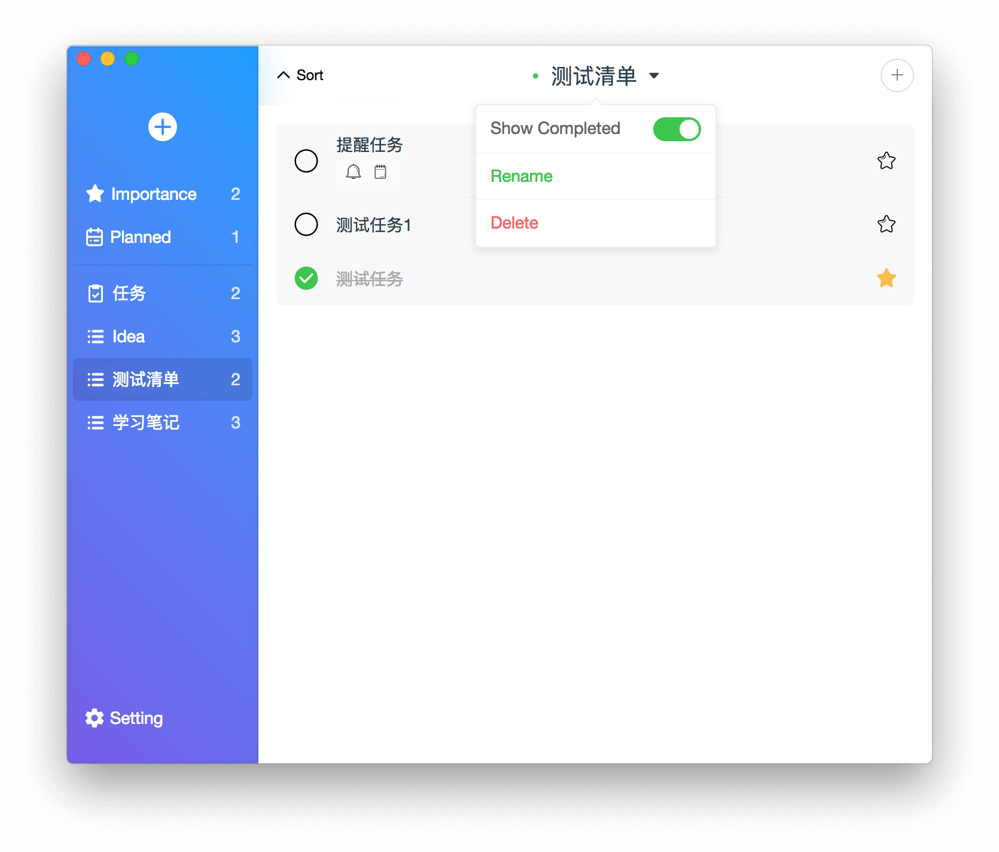

  因代码签名问题，旧版无法启动正常使用，请下载 New-Microsoft-ToDo.dmg或.zip重新安装。谢谢。 
  App crashed at app start up because of code sign invalid. Thank you.

## [New Release-2.0.2](https://github.com/woolson/microsoft-todo-mac/releases/tag/v2.0.2)

  

<h1 align="center">Microsoft ToDo</h1>

Welcome to star if you like it, Thanks!!!

[ZH Docs](/README_ZH.md)

- Based on [Electron](https://electronjs.org/) & [Electron Vue](https://simulatedgreg.gitbooks.io/electron-vue/)
- Microsoft [Outlook Task API](https://docs.microsoft.com/en-us/previous-versions/office/office-365-api/api/version-2.0/task-rest-operations)

## ScreenShot

[For more information](https://woolson.github.io/microsoft-todo-mac/)

## Feature

- Microsoft To-Do macOS client
- Native macOS APP experience
- Beautiful styles
  - Function display
  - Global search
  - Task Folder
  - Task
  - Preferences
- Support keyboard shortcut
  - Create Folder (Cmd + Shift + N)
  - Select Folder (Cmd + ↑/↓)
  - Create Task (Cmd + N)
  - Select Task (↑/↓)
  - Search/Cancel Search (Cmd + F/ESC)
  - Preferences (Cmd + ,)
- Support TouchBar
  - Create Folder
  - Create Task
  - Show/Hide Completed Task
  - Complete/Start Task (show on task choose)
  - Importance/Normal Task (show on task choose)
  - Delete Task (show on task choose)
- EN/中文 support
- Dark Mode (Suport macOS Mojave preference, and you can change theme manually in early macOS)
- Online upgrade
- Notification

## TODO

- Realtime Timezone(static Shanghai)
- Task Repeat support
- Attachment download
