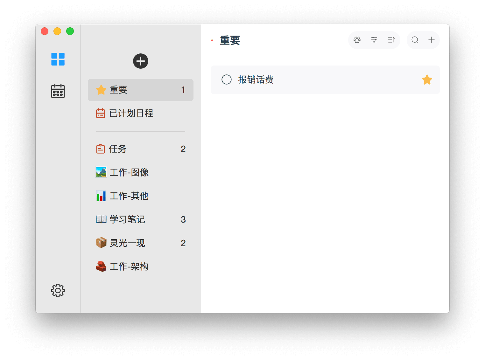
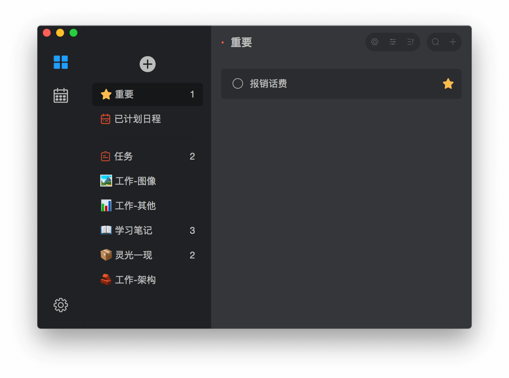

  

<h1 align="center">Microsoft ToDo</h1>

## News & Warning 新消息

> ⭕️**NOTICE 注意**  
> App crashed at app start up because of invalid code sign. 因代码签名问题，旧版无法启动正常使用。
> Download the latest version manually. **请手动下载最新版。**[**View newest 查看最新**](https://github.com/woolson/microsoft-todo-mac/releases/)  

>🔆**NEWS 新闻**  
> 微软出了macOS版的啦，预计2019年06月17日发布，现在可以去[**预约**](https://itunes.apple.com/cn/app/microsoft-to-do/id1274495053?mt=12)了。 
> *<u>在官方出来后此项目仍会继续，做自己心目中想要的样子，大家收录大家的意见的。</u>*

> 🎉**TIP 提示**  
> <u>Welcome to **★Star★** if you like it, Thanks. 喜欢请点下 **★Star★**，谢谢。</u>

## Tech 技术信息

- UI Develop 界面构建
  - Based on [Electron Vue](https://simulatedgreg.gitbooks.io/electron-vue/) - 基于[Electron Vue](https://simulatedgreg.gitbooks.io/electron-vue/)

- Data Source 数据来源
  - Microsoft [Outlook Task API](https://docs.microsoft.com/en-us/previous-versions/office/office-365-api/api/version-2.0/task-rest-operations)- 微软[Outlook接口](https://docs.microsoft.com/en-us/previous-versions/office/office-365-api/api/version-2.0/task-rest-operations)

## ScreenShot 软件截图

## Introduction 功能介绍

- Microsoft To-Do macOS client【Microsoft To-Do macOS客户端】
- Native macOS APP experience【原生APP的体验】
- Beautiful styles【清新易用的界面】
- Support keyboard shortcut【支持快捷键操作】
  - Create Folder【创建清单】 (Cmd + Shift + N)
  - Select Folder【切换清单】(Cmd + ↑/↓)
  - Create Task【创建任务】(Cmd + N)
  - Select Task【切换任务】(↑/↓)
  - Search/Cancel Search【搜索任务】(Cmd + F/ESC)
  - Preferences【设置】(Cmd + ,)
- **Support TouchBar【支持TouchBar操作】**
  - Create Folder【创建清单】
  - Create Task【创建任务】
  - Show/Hide Completed Task【切换显示已完成任务】
  - Complete/Start Task (show on task choose)【完成/开始任务（选中任务才会显示）】
  - Importance/Normal Task (show on task choose)【添加/去除 - 重要标注（选中任务才会显示）】
  - Delete Task (show on task choose)【删除任务（选中任务才会显示）】
- EN/中文 support【支持中英文】
- **Dark Mode (Suport macOS Mojave preference, and you can change theme manually in early macOS)【黑暗模式（支持根据Mojave系统设置，或者手动设置）】**
- **Online upgrade(Keep add feature & bug fix)【在线自动更新（保持更新新功能和修复问题）】**
- Notification【任务系统提示】

## Other 其他

欢迎使用和反馈，可在Issue中进行反馈所遇到的问题。
