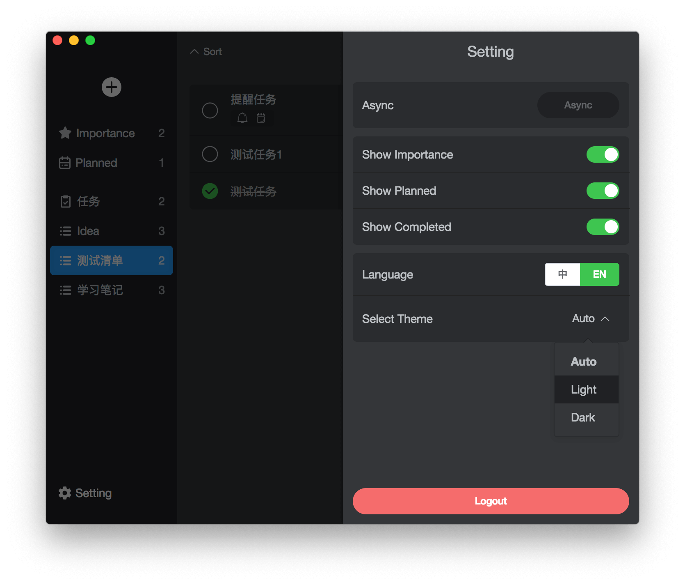

# MS ToDo

Welcome to star if you like it, Thanks!!!

[ZH Docs](/READMEmd)

- Based on [Electron](https://electronjs.org/) & [Electron Vue](https://simulatedgreg.gitbooks.io/electron-vue/)
- Microsoft [Outlook Task API](https://docs.microsoft.com/en-us/previous-versions/office/office-365-api/api/version-2.0/task-rest-operations)

Feature

- Microsoft To-Do macOS client ✔︎
- Native macOS APP experience ✔︎
- Beautiful styles
  - Function display ✔︎
  - Global search ✔︎
  - Task Folder ✔︎
    - Create ✔︎
    - Edit ✔︎
    - Delete ✔︎
  - Task
    - List ✔︎
    - Create ✔︎
    - Edit ✔︎
      - Remind ✔︎
      - Due ✔︎
      - Repeat ✘（Api data error）
      - Attachment ✔︎
      - Note ✔︎
    - Delete ✔︎
  - Preferences
    - Smart Folder ✔︎
    - Async Data ✔︎
    - Save Settings
- Support keyboard shortcut
  - Create Folder (Cmd + Shift + N) ✔︎
  - Select Folder (Cmd + ↑/↓) ✔︎
  - Create Task (Cmd + N) ✔︎
  - Select Task (↑/↓) ✔︎
  - Search/Cancel Search (Cmd + F/ESC) ✔︎
  - Preferences (Cmd + ,) ✔︎
- Support TouchBar
  - Create Folder ✔︎
  - Create Task ✔︎
  - Show/Hide Completed Task ✔︎
  - Complete/Start Task (show on task choose) ✔︎
  - Importance/Normal Task (show on task choose) ✔︎
  - Delete Task (show on task choose) ✔︎
- EN/中文 support ✔︎
- Dark Mode (Suport macOS Mojave preference, and you can change theme manually in early macOS) ✔︎
- Online upgrade ✔︎
- Notification ✔︎

## ScreenShot

